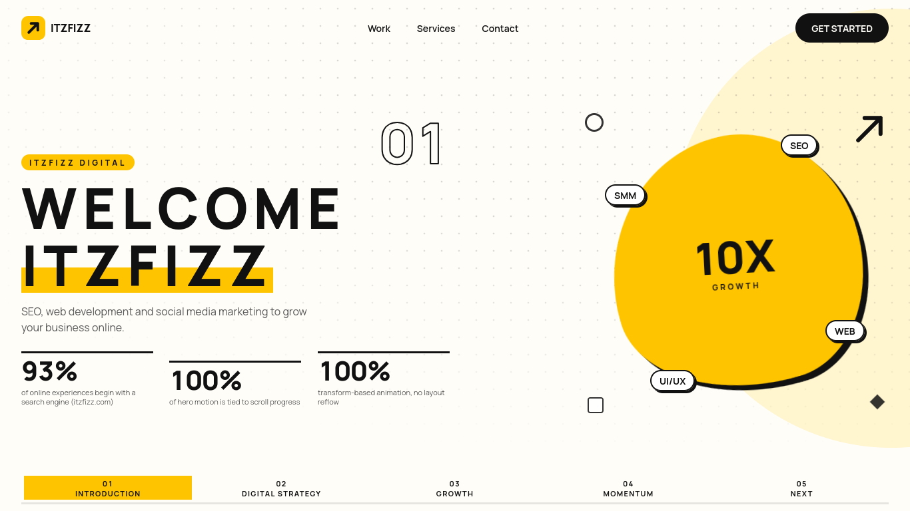
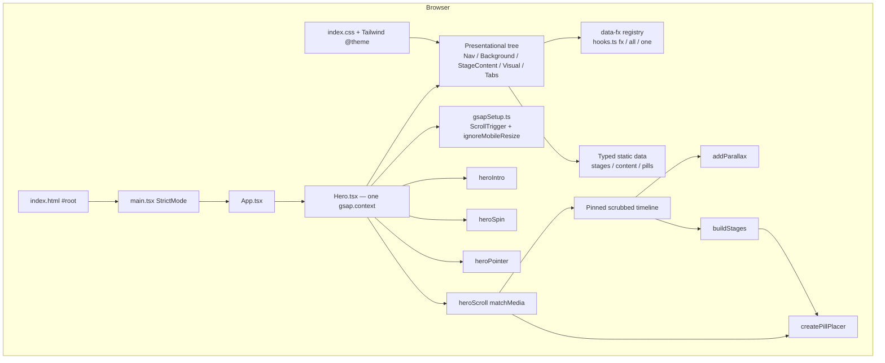
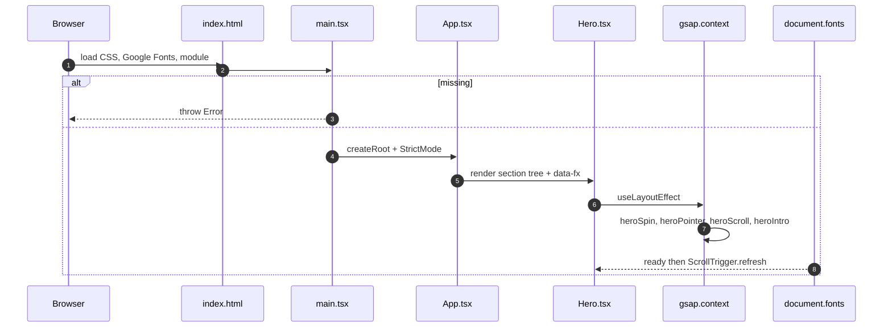
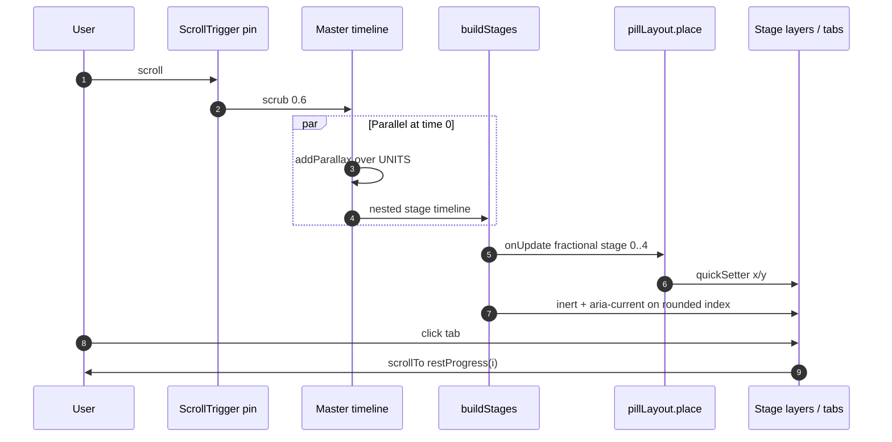
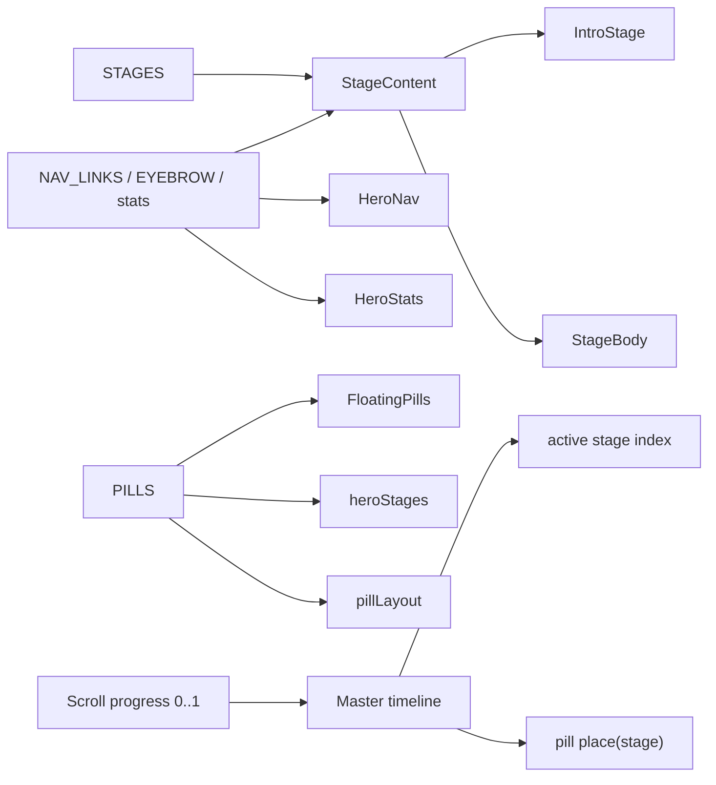
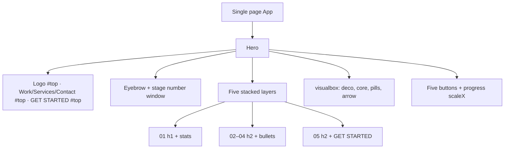

<p align="center">
  
</p>

<h1 align="center">Itzfizz Scroll-Driven Hero</h1>

<p align="center">
  A single-page React demo: one pinned hero that tells a five-stage story as you scroll.
  Copy is taken from <a href="https://itzfizz.com/">itzfizz.com</a>; the interaction is original GSAP/ScrollTrigger.
</p>

<p align="center">
  
  
  
  
  
  
</p>

<p align="center">
  <strong><a href="#preview">Preview</a></strong> ·
  <strong><a href="#what-this-project-is">Overview</a></strong> ·
  <strong><a href="#architecture-overview">Architecture</a></strong> ·
  <strong><a href="#setup--installation">Setup</a></strong> ·
  <strong><a href="#deployment">Deploy</a></strong>
</p>

---

## Preview

<p align="center">
  
</p>

The screenshot is the repository file `screenshots/preview.png`. It shows stage **01 Introduction**: the letter-split headline, three stats, the yellow core with orbiting pills, and the stage tab bar.

---

## What This Project Is

This repository is a **frontend-only marketing-hero demo**, not a full website, SaaS, or CMS.

| | |
| --- | --- |
| **What it does** | Pins one viewport-tall hero and scrubs a master GSAP timeline while the visitor scrolls. Five stages swap copy, tabs, and pill emphasis without unmounting layers. |
| **Who it is for** | Developers reviewing a scroll-driven UI assignment; anyone studying GSAP ownership rules, pin/scrub, and reduced-motion fallbacks. |
| **Problem it solves** | A long “how we work” story told in one frame: content, artwork, and chrome stay the same DOM objects while the narrative advances. |
| **What it is not** | There is no router, backend, database, authentication, CMS, or live fetch of itzfizz.com. Nav labels (`Work`, `Services`, `Contact`) and CTAs are in-page `#top` anchors. |

**Architectural characteristics that are actually in the code:**

- One `gsap.context` in `Hero`, torn down with `ctx.revert()` on unmount (and on React StrictMode remount).
- Animation targets are registered only through `data-fx` (`fx` / `all` / `one`). No ad-hoc CSS selectors in animation modules.
- Property ownership is explicit: intro, scroll, spin, pointer, and pill placement do not tween the same property on the same node.
- All five stage layers stay in the DOM, stacked in one CSS grid cell. Scrolling fades/clips them; inactive layers get `inert`.
- `prefers-reduced-motion: reduce` disables pin, scrub, spin, and pointer motion. CSS stacks the five stages as normal document flow.

---

## Features

Implemented in this repository:

- Five-stage pinned scroll story: Introduction → Digital strategy → Growth → Momentum → Next (`src/data/stages.ts`).
- Load-in timeline: nav, eyebrow, letter stagger, stats count-up, visual scale, pill fade, SVG arrow draw (`heroIntro.ts`).
- One scrubbed ScrollTrigger (`scrub: 0.6`, `anticipatePin: 1`, `invalidateOnRefresh: true`) owning parallax + stage hand-over (`heroScroll.ts`).
- Breakpoint-specific pin distances and parallax numbers: mobile / tablet / desktop (`motion.ts`).
- Tab bar: five real `<button>`s; click scrolls to the rest position of that stage.
- Orbiting service pills (SEO, WEB, UI/UX, SMM) placed with `quickSetter` on an ellipse sized from measured pill width (`pillLayout.ts`).
- Idle core spin with counter-rotated “10X GROWTH” text so the label stays upright (`heroSpin.ts`).
- Fine-pointer parallax on background `ptr` layers plus a magnetic header CTA (`heroPointer.ts`).
- Responsive copy: `headline.short` / `description.short` below 768px; at most two bullets on small screens; several short-viewport CSS rules in `src/index.css`.
- Accessibility: `aria-current="step"` on the active tab, `inert` on inactive layers, `sr-only` final stat values, `:focus-visible` outline, `min-h-11` tap targets on nav/tabs/buttons.
- Reduced-motion path in GSAP `matchMedia` **and** a CSS `@media (prefers-reduced-motion: reduce)` block.
- GitHub Pages deploy workflow (build `dist`, `actions/deploy-pages`).
- Vite `base: '/itzfizz-hero-scroll/'` so assets resolve under a project Pages subpath.

---

## Tech Stack

### Frontend

| Technology | Role in this repo |
| --- | --- |
| React 18.3 | UI. Single `App` → `Hero`. No React Router. |
| TypeScript (strict, `noUnusedLocals`, `noUnusedParameters`, `no-explicit-any`) | All `src/` and `vite.config.ts`. |
| Vite 8 | Dev server and production bundler. `@vitejs/plugin-react` v5 (Oxc refresh). |
| Tailwind CSS 4 | Utilities + `@theme` tokens via `@tailwindcss/vite`. No `tailwind.config.js` / PostCSS file. |
| GSAP 3 + ScrollTrigger | Intro, pin/scrub master timeline, spin, pointer, pill placement. |

### Content & assets

| | |
| --- | --- |
| Typed static modules | `src/data/stages.ts`, `content.ts`, `pills.ts` |
| Manrope | Loaded from Google Fonts in `index.html`; metric-matched `@font-face` fallback in CSS |
| SVG | Inline logo (`LogoMark`), core arrow, `public/favicon.svg` |

### Infrastructure

| | |
| --- | --- |
| GitHub Actions | `.github/workflows/deploy.yml` — Node 20, `npm ci`, `npm run build`, upload `./dist`, deploy Pages |
| Hosting target | GitHub Pages (static files only) |

### Tooling

| | |
| --- | --- |
| ESLint 9 flat config | `eslint.config.js` — `typescript-eslint` recommended + `eslint-plugin-react-hooks` |
| npm scripts | `dev`, `build` (`tsc -b && vite build`), `lint`, `preview` |

**Not in this repository:** backend, database, cache, auth, API client, state library, Docker, test runner, Prettier, environment files.

---

## Architecture Overview

The runtime is a static SPA. React mounts once; GSAP owns motion after layout.



**Why this shape:** there is no network layer. Stage copy never leaves the bundle. Scroll progress is the only “source of truth” for which stage is current (plus `matchMedia` for breakpoint / reduced motion).

---

## Project Structure

```text
.
├── .github/workflows/deploy.yml   # Pages build + deploy
├── public/favicon.svg
├── screenshots/preview.png
├── src/
│   ├── main.tsx                   # createRoot; throws if #root is missing
│   ├── App.tsx                    # <main><Hero /></main>
│   ├── index.css                  # Tailwind import, @theme, hero layout, motion CSS
│   ├── data/                      # STAGES, stats, NAV_LINKS, PILLS
│   ├── hooks/useReducedMotion.ts  # one-shot matchMedia read for first paint
│   ├── animations/                # GSAP modules (the behaviour)
│   └── components/
│       ├── LogoMark.tsx
│       └── hero/                  # Composition of the pinned section
├── index.html
├── vite.config.ts                 # react + tailwindcss plugins; base subpath
├── tsconfig.json
├── eslint.config.js
├── package.json
└── LICENSE                        # MIT, Copyright (c) 2026 get-manish
```

| Path | Why it matters |
| --- | --- |
| `src/components/hero/` | All on-screen structure. `Hero` is the only place that starts animation. |
| `src/animations/` | Isolated from JSX except through `data-fx`. Safe to reason about tween ownership here. |
| `src/data/` | All visitor-facing strings and pill poses. Edit copy without touching timelines. |
| `src/index.css` | Pin-safe overflow (`clip` not `hidden` on `body`), fluid type, short-viewport rules, reduced-motion layout. |

---

## Core Modules

### `src/components/hero/Hero.tsx`

- **Responsibility:** Compose the section and own the single `gsap.context`.
- **Inputs:** Mount of the `<section>` ref.
- **Outputs:** Starts `heroSpin`, `heroPointer`, `heroScroll` (each returns a stop function) and `heroIntro`. Cleanup calls those stops then `ctx.revert()`.
- **Dependencies:** GSAP context, child presentational components.
- **Why it matters:** If a second context were added, revert/StrictMode behaviour would fork.

### `src/animations/hooks.ts`

- **Responsibility:** The only target registry. `Fx` is a closed union of `data-fx` names.
- **Inputs / outputs:** `fx(name)` for JSX; `all(scope, name)` / `one(scope, name)` for animation code.
- **Why it matters:** Prevents selector drift. Adding a new animated node means extending `Fx` and tagging the element.

### `src/animations/gsapSetup.ts`

- Registers `ScrollTrigger` once.
- `ScrollTrigger.config({ ignoreMobileResize: true })` so mobile URL-bar resize does not refresh the pin and jump the frame.
- In **development only**, assigns `gsap` and `ScrollTrigger` on `window` so a browser console test can call `ScrollTrigger.getAll()`.

### `src/animations/heroScroll.ts`

- **Responsibility:** The hero’s **one** ScrollTrigger.
- Builds `gsap.matchMedia` queries: reduced motion, `max-width: 767px`, tablet 768–1199, desktop `min-width: 1200px`.
- Reduced-motion branch: only `createPillPlacer` (static layout pose), no pin.
- Motion branch: timeline with `ease: 'none'`, pin `root`, `end` from `MOBILE` / `TABLET` / `DESKTOP` (`+=2600` / `+=3000` / `+=3400`), then `addParallax` and `buildStages` at time `0`.
- Tab clicks: `window.scrollTo` to `st.start + (end-start) * restProgress(i)`.
- After `document.fonts.ready`, `ScrollTrigger.refresh()` so a late webfont does not leave a wrong pin height.

### `src/animations/heroStages.ts`

- **Responsibility:** Stage hand-over nested into the master timeline (not scrolled by itself).
- Exit tweens hit **wrappers** (`headline`, `body`); enter tweens hit **leaves** (`word`, `copy`, `point`). Layer opacity is never tweened.
- `inert` + `aria-current` updated from a scrubbed `{ stage }` proxy with custom `stageEase` (smoothstep only inside hand-over windows of half-width `W = 0.2`).
- Pill emphasis: one yoyo pulse on scale + `pillfill` opacity for pills whose `emphasis` stage is set.

### `src/animations/pillLayout.ts`

- **Responsibility:** x/y of pills. **Not** tweened by the scroll timeline.
- Measures ellipse radii from the pills layer and each label’s `offsetWidth` / `offsetHeight`, with `EDGE = 10` for the 1.2× emphasis scale.
- Writes positions with `gsap.quickSetter`. `ResizeObserver` remeasures.
- Interpolates angles between integer stages using each pill’s `poses` tuple in `pills.ts`.

### `src/animations/heroParallax.ts` + `measure.ts`

- Depth layers (`bg`, `dots`, `deco`, `core`, `ten`, `arrow`) each get **one** `fromTo` spanning `UNITS` (5).
- Core x/y/scale are functions (`safeDelta`, `safeScale`) that read `offset*` (transform-agnostic) and clamp motion inside `visualbox`.

### `src/animations/heroIntro.ts`

- Time-based, runs once, `power3.out` defaults.
- Built only under `(prefers-reduced-motion: no-preference)`.
- Count-up reads `data-target` / `data-suffix` on `count` nodes; resets to `0%` first because StrictMode cleanup can leave the final figure.
- Arrow uses `getTotalLength()` + `stroke-dashoffset`.

### `src/animations/heroSpin.ts` / `heroPointer.ts`

- Spin: inner `spin` +360 and `upright` −360 over 20s, infinite, linear. Scroll owns the **outer** `core` transform.
- Pointer: `hover: hover` + `pointer: fine` + no reduced motion. `quickTo` on `ptr` children (`data-depth`) and the header `cta`. rAF-coalesced `pointermove`.

### `src/data/stages.ts` / `content.ts` / `pills.ts`

- Five `Stage` records with source comments pointing at itzfizz.com sections.
- Stats: **93%** is from itzfizz.com SEO copy; the two **100%** figures describe **this demo’s** motion rules, not Itzfizz’s business.
- Pills: four ids, 72° step on a ring, bases 90° apart so labels do not coincide.

### `src/hooks/useReducedMotion.ts`

- Synchronous `matchMedia` read. `HeroStats` uses it as `useState` **initializer** so the first paint can show `93%` instead of `0%` when motion is reduced.

---

## Runtime Flow

### Application startup



React StrictMode runs the layout effect twice in development. Intro explicitly resets counters; context `revert()` is the general cleanup.

### Scroll story (motion allowed)



### Reduced motion

`heroScroll`’s `reduce` query skips the pin. CSS unsets `100svh` lock, turns `.stage-stack` into a column, unhides extra bullets, hides `.stage-tabs` and `.stage-num`, and forces `[data-fx="copy"]` visible. Intro/spin/pointer `matchMedia` queries do not build.

---

## Data Flow

There is no server state. Data is imported at build time.



**Stage ids in order:** `introduction` (01) · `strategy` (02) · `growth` (03) · `momentum` (04) · `next` (05). Stage 05 is the only one with a CTA (`GET STARTED` → `#top`).

---

## UI / Application Flow

There is **one screen**. No client-side routes.



Header primary nav is `hidden` below the `md` breakpoint; the GET STARTED button remains.

---

## State Management

Not a Redux/Zustand/Context app.

| Kind | Where |
| --- | --- |
| React render state | `Hero` ref; `HeroStats` boolean from reduced-motion initializer |
| Animation state | GSAP timelines, ScrollTrigger instance, `position.stage` proxy, `active` index in `buildStages` |
| Layout measurements | `offsetWidth` / `offsetHeight` + `ResizeObserver` in `pillLayout`; clamp helpers in `measure.ts` |
| Persistence | None. Reload returns to stage 01 at scroll top. |

---

## Database Architecture

Not explicitly implemented in the repository. Content is TypeScript modules compiled into the bundle.

---

## API / Communication Layer

Not explicitly implemented. No `fetch`, REST, GraphQL, or WebSocket usage in `src/`.

**External resource (not an application API):** `https://fonts.googleapis.com/css2?family=Manrope:...` in `index.html`.

---

## Authentication & Authorization

Not explicitly implemented. The demo is fully public static HTML/JS.

---

## Setup & Installation

Commands below are the ones defined in `package.json` / the workflow. There is no `format` or `test` script.

### Prerequisites

- Node.js **20** (CI uses `actions/setup-node` with `node-version: 20`)
- npm (lockfile is `package-lock.json`; CI runs `npm ci`)

### Installation

```bash
npm ci
```

(`npm install` also works for local development.)

### Environment variables

Not explicitly implemented. There is no `.env` or `.env.example`. The only env read in source is Vite’s `import.meta.env.DEV` in `gsapSetup.ts`.

### Development

```bash
npm run dev
```

Starts Vite. Open the local URL Vite prints (typically `http://localhost:5173`). With `base: '/itzfizz-hero-scroll/'`, the app is intended to be served under that path in production; the Vite dev server still hosts the app for local work.

### Production preview

```bash
npm run build
npm run preview
```

`preview` serves the `dist/` folder via Vite preview.

### Build

```bash
npm run build
```

Runs `tsc -b` then `vite build`. Output: `dist/` (gitignored). Asset URLs are prefixed with `/itzfizz-hero-scroll/`.

### Lint

```bash
npm run lint
```

ESLint over `**/*.{ts,tsx}`, ignoring `dist`.

### Test / Format

Not explicitly implemented. No test files (`*.test.*` / `*.spec.*`) and no Prettier/format script.

---

## Environment Variables

| Variable | Purpose | Required | Example/Default |
| --- | --- | --- | --- |
| — | No application env vars | — | — |

Vite injects `import.meta.env.DEV` / `PROD` automatically. Do not commit secrets; none are referenced.

---

## Docker

Not explicitly implemented in the repository.

---

## CI/CD

File: `.github/workflows/deploy.yml`  
Name: **Deploy to GitHub Pages**

```mermaid
flowchart LR
  push["push to main\nor workflow_dispatch"] --> build["Job: build\nubuntu-latest"]
  build --> checkout["actions/checkout@v4"]
  checkout --> node["setup-node@v4 Node 20 npm cache"]
  node --> ci["npm ci"]
  ci --> compile["npm run build"]
  compile --> artifact["upload-pages-artifact path ./dist"]
  artifact --> deploy["Job: deploy needs build"]
  deploy --> pages["actions/deploy-pages@v4\nenvironment github-pages"]
```



| Topic | Actual behaviour |
| --- | --- |
| Triggers | `push` to `main`; manual `workflow_dispatch` |
| Permissions | `contents: read`, `pages: write`, `id-token: write` |
| Concurrency | group `pages`, `cancel-in-progress: true` |
| Tests / lint in CI | **Not run.** Only `npm run build` |
| Artifact | `./dist` |

After first deploy, GitHub Settings → Pages must use **GitHub Actions** as the source (called out because the workflow cannot flip that toggle by itself).

---

## Deployment

| | |
| --- | --- |
| **Platform** | GitHub Pages via Actions |
| **Build command** | `npm run build` |
| **Deploy command** | `actions/deploy-pages@v4` (no manual rsync/SSH in-repo) |
| **Required GitHub permissions** | Pages write + id-token (OIDC) as in the workflow |
| **Produced artifacts** | Static `dist/index.html` + hashed JS/CSS |
| **URL shape** | Project site under `/itzfizz-hero-scroll/` (`vite.config.ts` `base`) |

No git `remote` is configured in this working copy, so the live `*.github.io` URL cannot be determined from the repository alone.

**Production architecture:** CDN-backed static hosting. No origin server, no SSR.

---

## Performance Considerations

Present in code (not synthetic benchmarks):

| Technique | Implementation |
| --- | --- |
| Transform-only motion | Comments and practice: transform, opacity, `clip-path`, `stroke-dashoffset`. Avoids layout animation. |
| Scrub smoothing | `scrub: 0.6` instead of 1:1 tying to the wheel. |
| `will-change` limited | `.wc` only on layers that move; cleared under reduced motion. |
| Pointer coalescing | `requestAnimationFrame` gate in `heroPointer`; `quickTo` / `quickSetter` instead of creating tweens per event. |
| Measurement without transforms | `offsetLeft` / `offsetWidth` so intro scale does not poison clamp math. |
| Font-metric fallback | `@font-face` `size-adjust` / ascent overrides so pin height stays stable during `display=swap`. |
| Overflow without a nested scroller | `overflow-x: clip` on `html, body` — `hidden` would make `body` a ScrollTrigger scroller and break pin. |
| Mobile URL bar | `ignoreMobileResize: true`. |
| CSS containment of paint | `isolate` on the visual stack; decorative layers `aria-hidden`. |

**Not implemented:** route-level code splitting (there is one route), image CDN, service worker, React `memo`/`useMemo` hot paths, virtualization.

Vite still emits a single hashed JS chunk plus CSS for this app.

---

## Security Considerations

### Implemented

- No application secrets, tokens, or API keys in source.
- Static site: no SQL, no auth cookies, no CORS configuration to get wrong.
- `rel` on the Google Fonts stylesheet is a standard render-blocking stylesheet (third-party CSS).
- Focus outline is forced for keyboard users (`:focus-visible`).
- Inactive stage layers are `inert`, so the hidden GET STARTED control is not tabbable mid-scroll.

### Not implemented / risks

| Issue | Evidence |
| --- | --- |
| **Third-party font origin** | `fonts.googleapis.com` in `index.html`. Privacy/network depends on Google. Self-hosting is not implemented. |
| **Dev globals on `window`** | `gsapSetup.ts` exposes GSAP when `import.meta.env.DEV`. Production builds should tree-shake this branch; do not copy that assignment into prod debugging blindly. |
| **No Content-Security-Policy** | Not set in `index.html` or Pages config in-repo. |
| **No dependency audit in CI** | Workflow does not run `npm audit`. |
| **In-page-only links** | Cannot be an open-redirect issue; also means “Contact” does not go anywhere real. |
| **XSS surface** | Copy is static JSX text, not `dangerouslySetInnerHTML`. Still a static demo — no user-generated content pipeline. |
| **GSAP license** | The package is a runtime dependency. Confirm license terms for your use; this README does not assert a commercial license grant. |

No hard-coded passwords or cloud credentials were found.

---

## Error Handling

| Location | Behaviour |
| --- | --- |
| `main.tsx` | Throws if `#root` is absent. |
| `heroStages.ts` `add()` | Skips empty target lists instead of GSAP “target not found” warnings. |
| `heroParallax.ts` | Guards on `length` / null `core`/`box`. |
| `pillLayout.ts` | No-op placer if the pills layer or anchors are missing. |
| React | **No** `ErrorBoundary`. A runtime throw in an effect unmounts the tree with the default overlay in dev. |
| Network | N/A (no API). A blocked Google Font falls back to `Manrope Fallback` / system UI. |

---

## Testing

Not explicitly implemented.

- No unit, component, or E2E test files.
- CI does not run lint or tests; typecheck happens only because `npm run build` starts with `tsc -b`.
- The `window.gsap` / `window.ScrollTrigger` assignment is a development aid, not an automated suite.

---

## Limitations

- **Frontend-only demo.** No multi-page site, forms, CMS, or Itzfizz backend integration.
- **Nav/CTA are stubs.** Every header link and the stage-05 button uses `href="#top"`.
- **No automated tests.**
- **CI does not lint.** A well-typed-but-style-violating PR can still deploy if `tsc` and Vite succeed.
- **`.pills-layer` has no CSS rule** in `src/index.css` even though `FloatingPills.tsx` comments describe extra width below 768px. Current layout for that node is the Tailwind classes on the same element (`absolute inset-y-0 left-1/2 …`). The mobile “wide ellipse” behaviour described in the comment is not backed by a matching stylesheet block in the current tree.
- **`.stage-num-track` is similarly unstyled** beyond parent `.stage-num` overflow; the slide relies on GSAP `yPercent` and default block layout of five numbers.
- **Google Fonts required for intended type.** Fallback exists but is not Manrope itself.
- **Assignment copy vs. live site.** Strings are snapshotted in TypeScript comments; they will drift if itzfizz.com changes.
- **`base` is hard-coded** to `/itzfizz-hero-scroll/`. Hosting at the domain root or a different repo name needs a Vite `base` change.
- **Single light theme.** `color-scheme: light` only.
- **No i18n.**

---

## Future Improvements

Proposed only from gaps above — not committed work:

1. Add unit tests around `restProgress`, `stageEase`, and `safeDelta` / `safeScale`, plus a reduced-motion render test.
2. Run `npm run lint` (and tests) in the GitHub Actions `build` job before uploading Pages.
3. Either implement `.pills-layer` width rules as the comment describes, or delete the stale comment.
4. Self-host Manrope to remove the Google Fonts request.
5. Make `base` configurable (`import.meta.env.BASE_URL` is already how Vite applies it; the repo just hard-codes the string).
6. Wire real destinations for Work / Services / Contact if this ever becomes more than a hero study.
7. Add an Error Boundary around `Hero` so a GSAP measurement failure cannot blank the whole document.

---

## Contributing

1. Install with `npm ci`.
2. Use `npm run dev` for the pin/scrub loop; check **mobile, tablet, and desktop** plus **prefers-reduced-motion**.
3. Keep tween ownership: do not animate a property already owned by another module on the same `data-fx` node.
4. New GSAP targets: extend `Fx` in `hooks.ts` and tag the element with `{...fx('name')}`.
5. Copy changes belong in `src/data/`, with a source comment if the string is claimed from itzfizz.com.
6. Run `npm run lint` and `npm run build` before opening a PR.
7. Do not add secrets. Pages deploys whatever `main` builds.

There is no `CONTRIBUTING.md` or issue template in this repository.

---

## License

[MIT](./LICENSE). Copyright (c) 2026 **get-manish**.

Content inspired by public copy on [itzfizz.com](https://itzfizz.com/). This repo is not an official Itzfizz product.
